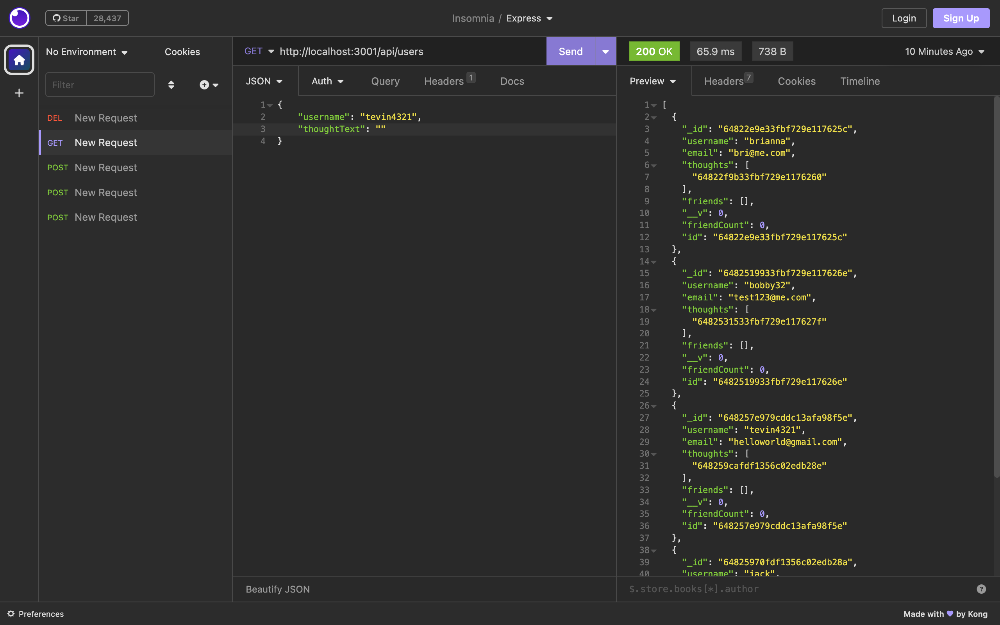

# backend--social--network-API

## Description

I was motivated to complete this project because iwanted to learn the basics of creating the backend of a social media site. I built the project to understand how to add users and thoughts to social media backend. this project will help a beginer understand the basic of the backend.

## Table of Contents (Optional)

- [Installation](#installation)
- [Usage](#usage)
- [Credits](#credits)
- [License](#license)
- [Video](#video)

## Installation

you will need to install node, express, and  monogoose for this project. 

## Usage

Use Insonmia to navigate through the backend

## Credits

N/A

## License

MIT License

## Video

https://drive.google.com/file/d/1sHVHYHZsoebNQMHaMnJLkw1z6lEGvNOM/view

